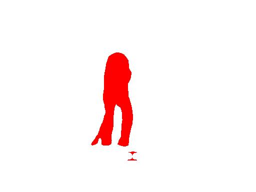
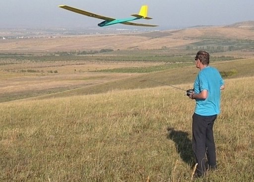
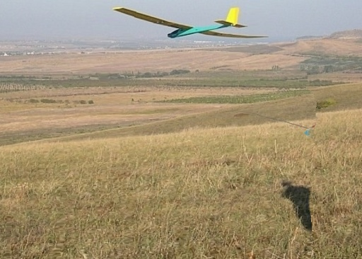
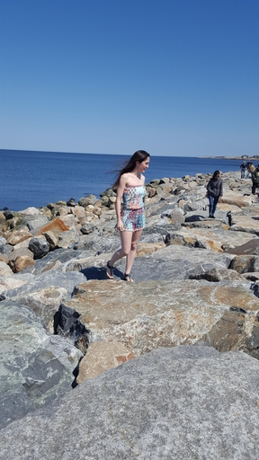
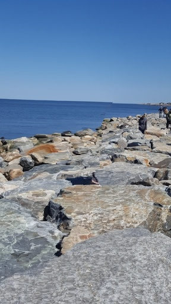
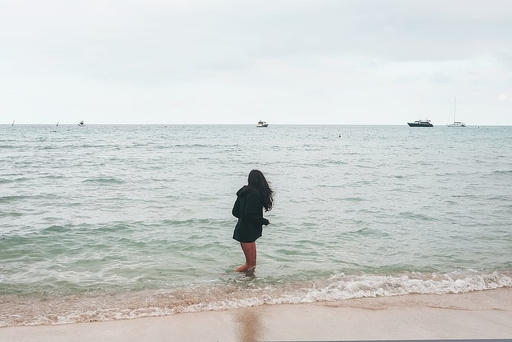
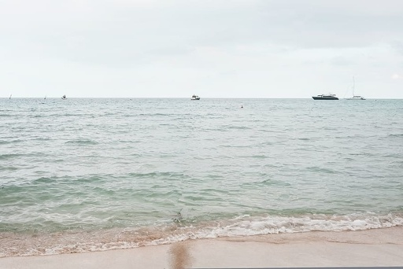

# Automatic Human removal in photo using Image Segmentation in Deep Learning (dl4j) + Seam Carving Algorithm in Java

## Animated Demo


## Before And After

 

## How to run

### Docker
docker is probably the easiest way to run this, so you do not have to download the model manually

```
# Building the docker image, will take a while for the first time to download all dependencies
docker build . -t dl4j_human_remover
```
```
# Run it as web server
docker run --rm -p 5000:5000 dl4j_human_remover
```

```
curl http://localhost:5000/removehuman --data-binary "@/path_to_image/image.jpg" --output /output_path/output.jpg
# where /path_to_image/image.jpg is the input and /output_path/output.jpg is the output file you want it to be located at
```

### Intellij
Download the model at http://download.tensorflow.org/models/deeplabv3_mnv2_pascal_train_aug_2018_01_29.tar.gz and extract it. Set environment variable MODEL_PATH to be where the extracted frozen_inference_graph.pb is at


## How it works

Automatic human removal is essentially solving 2 problems.
1. Detect a human from photos
2. Remove an object from photos without distorting the photo

Point 1 is solved by the power of deep learning while point 2 is solved by traditional computer vision algorithm

### 1. Image segmentation using deep learning
This project imports a Deep Learning Image segmentation model (MobileNet) pre-trained on Tensorflow (http://download.tensorflow.org/models/deeplabv3_mnv2_pascal_train_aug_2018_01_29.tar.gz) to Deeplearning4j (nd4j) for detecting human from the photo

Input:

 

Output as Mask:



### 2. Content-aware image resizing in Computer Vision (Seam Carving Algorithm)
With the masked area detected, we make use of Seam Carving Algorithm (https://en.wikipedia.org/wiki/Seam_carving) with energy in the masked area set to zero so that all seams will pass through the mask area during the downsizing. After all masked area removed, we will be (content-aware) upsizing the image again using the same algorithm.

## References
https://en.wikipedia.org/wiki/Seam_carving

https://github.com/PacktPublishing/OpenCV-with-Python-By-Example/blob/master/Chapter07/object_removal.py

## More examples

 

 

 

## Ideas / Improvement
My original thought before discovering Seam Carving Algorithm is to use Deep Learning for Generative inpainting too (e.g. https://github.com/JiahuiYu/generative_inpainting). However, I found that it is not always that straightforward to port Tensorflow model to nd4j if it isn't already in frozen graph format. Therefore I've turned to traditional Computer Vision algorithm and find Seam Carving, which surprisingly produce a better result visually on my few testing images.

Feel free to submit Pull requests for idea contribution
